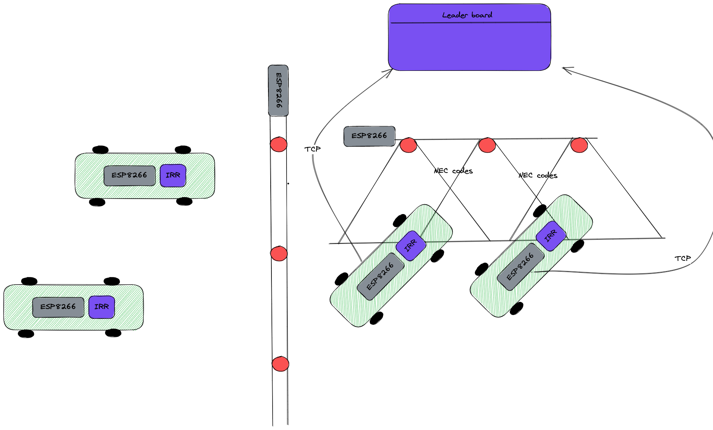

# Lap Counter
Each car has an ESP8266 with a IR receiver. The overhead bridge has a set of IR LEDs that emid NEC codes. When a car drives under the bridge it's receiver is illumnated and it decodes the NEC code. It then sends a TCP message to the LeaderBoard app.

Laps are counted and winners are born!

TODO:
https://github.com/arduino-libraries/NTPClient
Set a time and send that so delays are not a problem, needs a re-write of the LeaderBoard as https://sourceforge.net/projects/laptrackertk/files/ is currently being used.